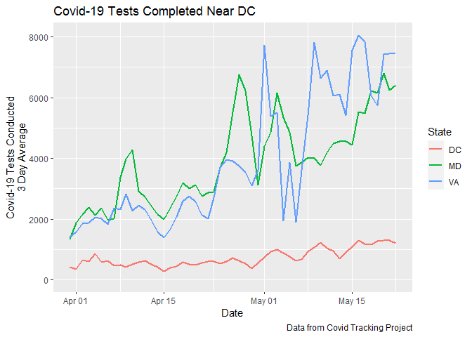

Positive Covid-19 Test Rate Increases Around DC
================

2020-05-01 10:28:29

The number of Covid-19 tests conducted in the DC area increased
considerably through the first part of April and has generally plateaued
since then. However, the positive test rate has increased recently,
suggesting that the plateauing case numbers may be a result of
plateauing testing capability.

The graph below shows a rolling three-day average of tests conducted in
DC, Maryland, and Virginia. Note: Maryland only began reporting negative
tests in late March, so I’ve truncated most of the Maryland data until
it doesn’t show abnormal spikes in late March.

<!-- -->

Despite plateauing or decreasing numbers of tests in the area, the
cumulative positive test rate has increased over time since the rates
spiked in mid-March, when fewer Covid-19 tests were being conducted.
Right now, the cumulate positive rate in DC is 21.5%, the rate in
Maryland is 19%, and the rate in Virginia is 17.3%.

<!-- -->

The recent increases in positive test rates are more pronounced when
displayed as recent, rather than cumulative, averages. The average
positive test rate between 2020-04-28 and 2020-04-30 was 25.9% in DC,
24% in Maryland, and 21.3% in Virginia.  
\` <!-- -->

New York state has generally had the highest testing rate of any state,
due to New York City being the center of the Covid-19 pandemic in the
United States. However, even with a high number of tests, the positive
test rate spiked precipitously as the daily death rate started climbing
in the state. The positive test rate peaked more than a week before the
daily death rate peaked in the state.

<!-- -->

The DC area clearly hasn’t seen a rise like in New York. However, the
rising positive test rate and plateauing number of tests that are being
conducted in DC, Maryland, and Virginia suggests that the area probably
isn’t experiencing a major decline in the number of cases. Also, after
that statement, it’s probably a good time to mention I am not an
epidemiologist and probably talk to one or read something by one before
taking that previous sentence as gospel.

## Appendix: DC Test Rates

This plot simply shows the cumulative positive test rate using data
directly from the DC government.

<!-- -->
