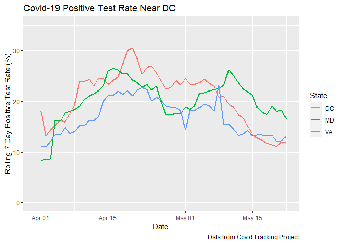
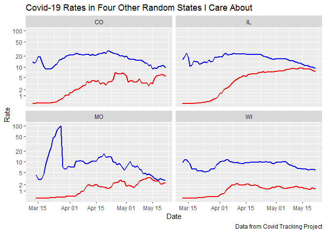
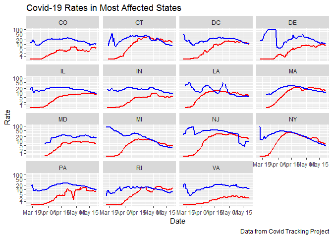
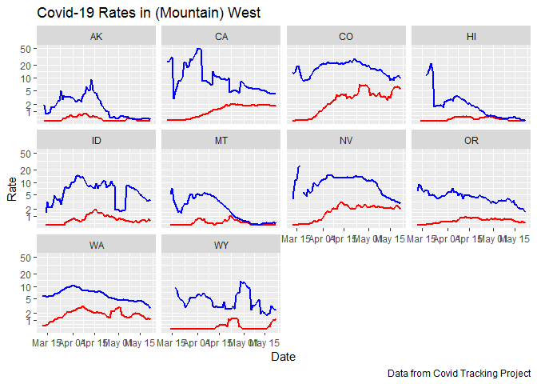
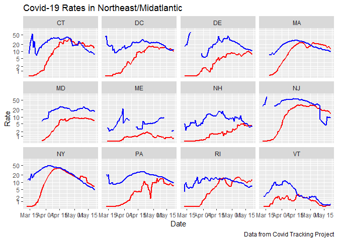
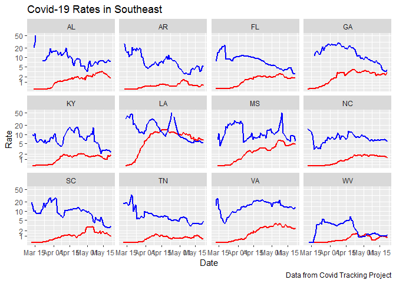
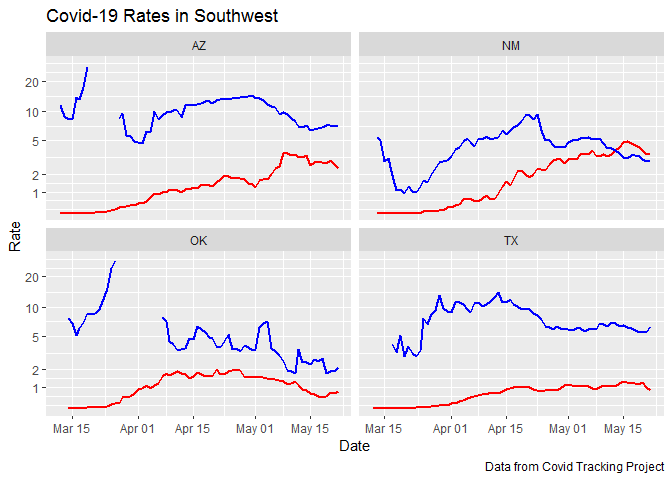
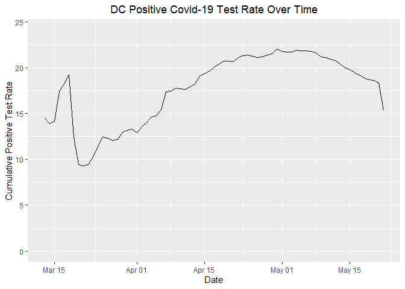

Positive Covid-19 Test Rate Increases Around DC
================

2020-05-18 18:37:23

The number of Covid-19 tests conducted in the DC area has increased
through April and May. The positive test rate has declined more slowly
in some areas.

The graph below shows a rolling three-day average of tests conducted in
DC, Maryland, and Virginia. Note: Maryland only began reporting negative
tests in late March, so I’ve truncated most of the Maryland data until
it doesn’t show abnormal spikes in late March.

<!-- -->

Right now, the cumulate positive rate in DC is 19.2%, the rate in
Maryland is 19.7%, and the rate in Virginia is 15.9%.

<!-- -->

The more recent positive test rates show recent declines in the rate in
DC and VA. The average positive test rate between 2020-05-11 and
2020-05-17 was 11.6% in DC, 17.4% in Maryland, and 13.3% in Virginia.  
\` <!-- -->

New York state has generally had the highest testing rate of any state,
due to New York City being the center of the Covid-19 pandemic in the
United States. However, even with a high number of tests, the positive
test rate spiked precipitously as the daily death rate started climbing
in the state. The positive test rate peaked more than a week before the
daily death rate peaked in the state.

<!-- -->

The DC area clearly hasn’t seen a rise like in New York. It’s unclear
how correlated the postitive rate and death rate has been in the area.

I’m currently experimenting with the following plots and just posting
them for me to look at:

<!-- -->

<!-- -->

<!-- -->

<!-- -->

<!-- -->

<!-- -->

<!-- -->

<!-- -->

## Appendix: DC Test Rates

This plot simply shows the cumulative positive test rate using data
directly from the DC government.

<!-- -->
