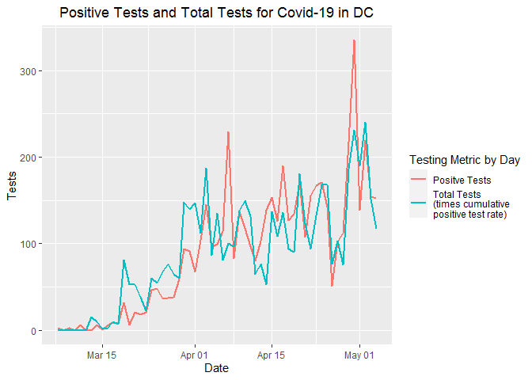

Lag in DC Test Results
================

### Postive Covid-19 Results in DC Lag by About Four Days

10 April, 2020

The below plot shows the number of Positive Tests in red and the number
of New Tests (multiplied by the positive test rate) in blue. Although
the numbers tracked pretty well early on in testing, they have diverged
recently. The correlation coefficient is currently 0.8044366.

<!-- -->

The below plot shows the number of Positive Tests in red compared to the
number of New Tests four days ago (times the cumulative positive test
rate) in blue. These numbers track much better, with a current
correlation coefficient of 0.9247856.

<!-- -->

Here is the correlation matrix for those interested in such a thing.

    ##             Test_New   Pos_New Test_Lag_1 Test_Lag_2 Test_Lag_3 Test_Lag_4
    ## Test_New   1.0000000 0.8044366  0.7895463  0.8331691  0.7154886  0.7572864
    ## Pos_New    0.8044366 1.0000000  0.7077803  0.8070302  0.7686444  0.9247856
    ## Test_Lag_1 0.7895463 0.7077803  1.0000000  0.7951094  0.8356549  0.7248161
    ## Test_Lag_2 0.8331691 0.8070302  0.7951094  1.0000000  0.7969671  0.8382720
    ## Test_Lag_3 0.7154886 0.7686444  0.8356549  0.7969671  1.0000000  0.8002385
    ## Test_Lag_4 0.7572864 0.9247856  0.7248161  0.8382720  0.8002385  1.0000000
    ## Test_Lag_5 0.6663326 0.7581325  0.7454738  0.7298300  0.8422834  0.8134102
    ## Test_Lag_6 0.7263917 0.8518991  0.6661792  0.7463855  0.7298315  0.8441130
    ## Test_Lag_7 0.6626945 0.8262093  0.7203636  0.7017611  0.7824712  0.7885645
    ##            Test_Lag_5 Test_Lag_6 Test_Lag_7
    ## Test_New    0.6663326  0.7263917  0.6626945
    ## Pos_New     0.7581325  0.8518991  0.8262093
    ## Test_Lag_1  0.7454738  0.6661792  0.7203636
    ## Test_Lag_2  0.7298300  0.7463855  0.7017611
    ## Test_Lag_3  0.8422834  0.7298315  0.7824712
    ## Test_Lag_4  0.8134102  0.8441130  0.7885645
    ## Test_Lag_5  1.0000000  0.8181544  0.8460233
    ## Test_Lag_6  0.8181544  1.0000000  0.8688375
    ## Test_Lag_7  0.8460233  0.8688375  1.0000000

A couple notes. First, the test counts for 20 March were missing so I
averaged the 19 March and 21 March test rate. In addition, for the
initial lagged variables, I made the defaults zero. This could make the
correlation metrics stronger for the lagged variables, but the effect
doesn’t look uniform.
